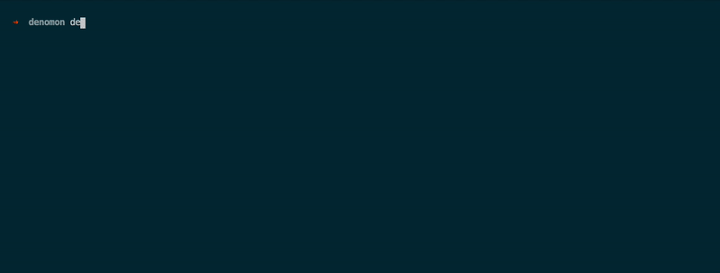

# Denomon
A nodmon replacement for denoJS.

File changes watcher for develpoment environment.

Watch & compile typescript file using deno with bash script.



### Usage

1. Download bash script file
```
wget https://raw.githubusercontent.com/MosHarush/denomon/master/denomon -O /usr/local/bin/denomon && chmod +x /usr/local/bin/denomon
```

2. Run **denomon** using this command :

```
$ denomon <your file>
```

### License
This project under MIT License
